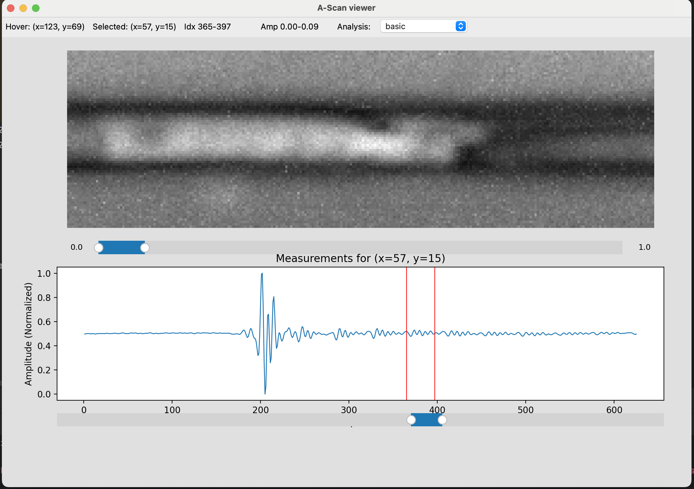
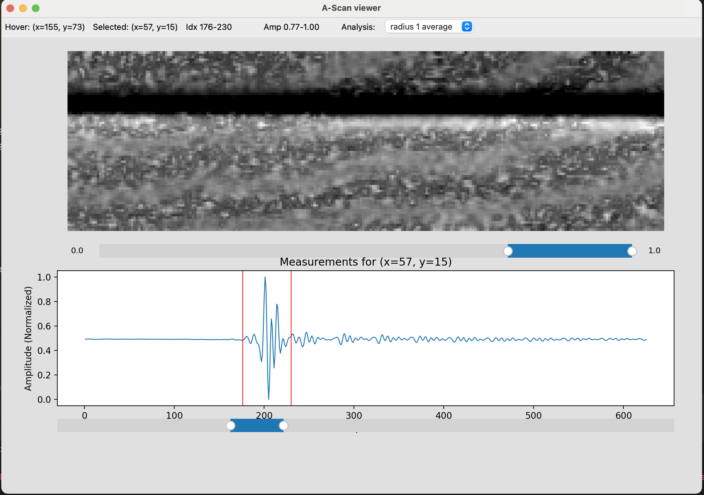

# A‑Scan / C‑Scan Ultrasonic Viewer

Ultrasonic inspection generates massive amounts of data across 2D areas. This project simplifies and speeds up visual inspection by:

- Allowing quick comparison between different points
- Enabling image-style exploration of ultrasonic data
- Supporting multiple processing modes (basic vs. smoothed)
- Offering flexible sliders to refine the view instantly

It’s designed to help researchers and engineers make decisions faster and with more confidence when exploring test results.

## What does this project do?

- Loads ultrasonic scan data from an `.hdf5` file.
- Renders a 2D grayscale amplitude image (C-scan) computed from the signal vector at each point.
- Lets the user hover and click on pixels to view the corresponding A-scan waveform.
- Allows live adjustment of:
  - Sample index range (horizontal signal window)
  - Amplitude window (contrast scaling)
- Supports alternative analysis modes, including neighborhood smoothing.

## Input

The application expects an HDF5 file (`.hdf`, `.h5`, or `.hdf5`) that contains a dataset named `"A-Scans"` with the following specifications:

- Shape: (18130, 625)
- Type: signed 16-bit integers or similar

Internally, the data is reshaped into:

(74 rows, 245 columns, 625 samples per vector)

Each pixel in the amplitude image corresponds to a time-domain waveform (A-scan) at a physical location.

## Output

- A main window with:
  - A grayscale amplitude image (C-scan map)
  - A live hover coordinate display
  - A dropdown to select analysis type
  - A bottom waveform plot that updates on click
- The user can export the amplitude image as a PNG snapshot, with a filename reflecting the selected pixel and analysis parameters.

## Analysis modes

The drop-down menu allows selection of different amplitude analysis modes:

1. Basic:  
   Uses the raw vector at each (x, y) position.

2. Radius 1 average:  
   For each pixel, the A-scan is replaced with the average of its own signal and the signals of its 8 neighbors (a 3×3 box around it). This reduces noise and highlights consistent features.

## Screenshots

### Basic mode

### Radius 1 average

In both images, the amplitude image is shown at the top, and the waveform for a selected pixel is shown at the bottom. In the averaged mode, local noise is reduced and broader structures emerge more clearly.

## How to use this project

1. Download  
   Clone or download the repository to your computer.

2. Install dependencies  
   You must have Python 3.7–3.11 installed.  
   This project uses the following Python libraries:
   - numpy
   - h5py
   - matplotlib
   - PyQt5

   To install them, open a terminal and run:

   pip install numpy h5py matplotlib PyQt5

3. Run the application  
   Make sure you're inside the folder containing viewer.py, then run:

   python viewer.py

   This will launch the graphical interface.

4. Load a sample file  
   Once the app is open:
   - Go to the File menu → Open…
   - Choose the included example scan file:
     docs/sample_scan.hdf5

   You can then interact with the image, view waveforms, adjust sliders, change analysis modes, and export PNGs.

### Course Information
This project was proposed as part of the course [Basic Programming Skills in Python](https://github.com/Code-Maven/wis-python-course-2025-03), led by [Gábor Szabó](https://github.com/szabgab) at the [Weizmann Institute of Science](https://www.weizmann.ac.il) in Israel 🇮🇱
